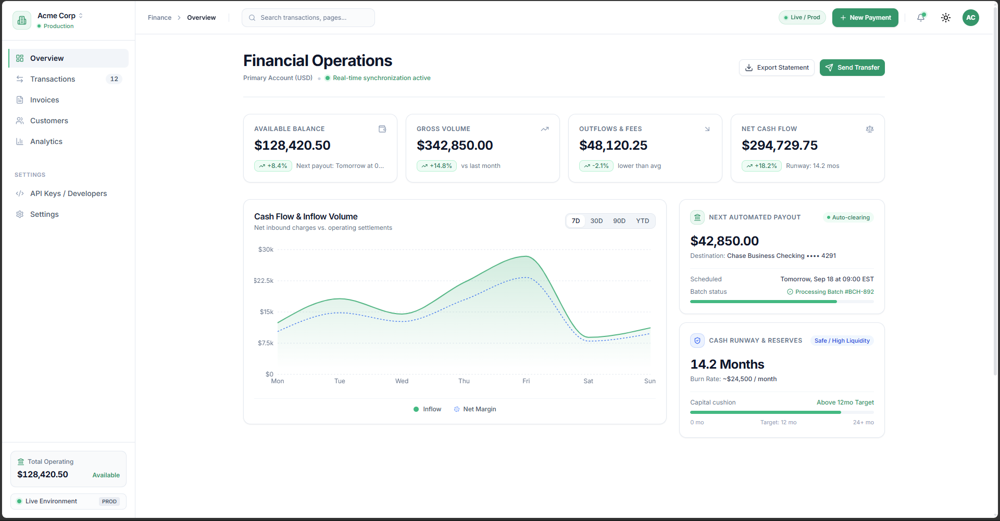

# PayTrack – Stripe-Inspired Dashboard Clone

A modern, responsive, and animated dashboard clone inspired by Stripe, built with **Next.js App Router**, **TailwindCSS**, and **Recharts**.

This project is designed to simulate a production-grade dashboard for managing transactions, analytics, and user data. Built as a portfolio piece to demonstrate real-world frontend architecture.

---

## 🚀 Tech Stack

- **Framework**: Next.js 16 (App Router)
- **Styling**: TailwindCSS + Dark Mode (`next-themes`)
- **Charting**: Recharts
- **Animation**: Framer Motion
- **State & Logic**: React hooks
- **Deployment**: Vercel

---

## ✨ Features

- ⚡ Realistic dashboard layout
- 🌗 Dark mode support (toggle)
- 📊 Interactive chart
- 🧾 Paginated + filtered transaction table
- 💨 Smooth scroll-reveal animations
- ✅ Responsive across all breakpoints

---

## 🔗 Live Demo

👉 [Visit PayTrack Dashboard](https://pay-track.haerulr2.dev)

---

## 📌 Purpose

This project is built **solely for educational & portfolio purposes**. It is **not affiliated** with Stripe or any third-party brand.

---

## 📃 License

MIT License – [read here](./LICENSE)

